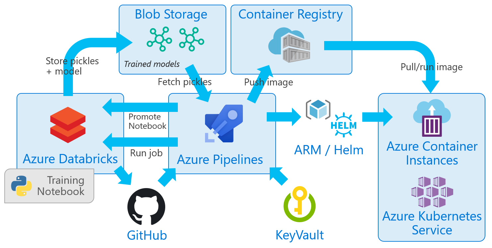

# Project Batcomputer
Project Batcomputer is a working example of DevOps applied to machine learning

Motivations for this project:
- Understand the challenges in operationisation of ML models
- Attempt to make a reality of “DevOps for AI” 
- Existing processes (e.g. Azure Machine Learning Service) deemed problematic

**Why "Project Batcomputer"?**  
The main model trained and used as the foundation of the project is based on crime data, and predictions of outcomes of crimes (convictions etc). The [Batman Batcomputer](https://en.wikipedia.org/wiki/Batcomputer) seemed like way to make such a prediction model more fun and interesting. 

Some of the main themes that make up the project:
- Wrapper app that allows the model to be run as a RESTful web API
- Continuous integration with *Azure Pipelines*
- Training Python notebooks that carry out the machine learning using Scikit-Learn 
- Infrastructure as code based deployments into Azure
- Used of containers and Kubernetes

## Automation Flow
A high level flow of the train, build & deploy process is shown here


## Model Registry
The integration point between the training and the deployment as the API service app is the "model registry". The training process is expected to output pickled files (i.e. serialized objects) and upload them into *Azure Blob storage*. 

Not only is the model pickled and stored, but two other files are output from the training process and also stored in the blob storage model registry

- **model.pkl** - The main trained Scikit-learn model
- **lookup.pkl** - Mapping parameters/strings to numbers (features) for passing into predict function. This is a dictionary of the encoded labels used in the training
- **flags.pkl** - Maps output of prediction function to human readable strings or labels

The naming convention used in the storage account is:
```
/{model-name}/{version}/{file}.pkl
```
Where `{model-name}` is a Blob storage container for the model, e.g. "batcomputer" and `{version}` is our version string as a virtual directory, e.g. "1.0.0"

**Why the extra files & complexity?**  
It was a design goal of the project not to present a dumb wrapper around the scoring function i.e. `model.predict_proba(features)` where a raw array of numbers is the expected input to the API. The `lookup.pkl` file provides a means for the developer working on training the model, to pass the encoded labels to the app and from there a more human friendly API can be exposed. And `flags.pkl` is used correspondingly to providing meaningful names for the results/scores


## Project Index
As there are a significant number of components, interactions & products involved in this project. An attempt has been made to break the things into standalone sections:

- [Model training & machine learning in DataBricks](#machine-learning)
- [Wrapping the model in an API service](#model-api-service--wrapper-app)
- [DevOps CI/CD automation & pipelines](#devops-cicd)
- [Complete end to end flow](#end-to-end-flow)

## Repo Structure
The project doesn't represent a single codebase, there are multiple sets of artifacts, configuration files and sourcecode held here. The top level folders are as follows:
```
/assets      - Art and stuff
/azure       - Azure ARM templates
/batclient   - Frontend web client of Batcomputer to demo the model API
/data        - Source training data
/databricks  - Configuration files and info for setting up DataBricks
/docs        - Documentation & guides 
/kubernetes  - Kubernetes configurations
 └ helm      - Helm charts to deploy the wrapper API into Kubernetes
/model-api   - Source for Python model wrapper API 
/notebooks   - Training Python notebooks, synced with DataBricks via git
/devops      - Scripts, pipelines and docs relating to CI/CD
 └ pipelines - Azure DevOps Pipelines 
```

### Presentation Deck
[Full background and documentation can be found in the provided slides](docs/Project-Bat-Computer-Slides.pdf)  
(Work in progress)

---

# Machine Learning & Training

## Technology Stack
- [Azure DataBricks](https://azure.microsoft.com/en-gb/services/databricks/)
- [Python 3]((https://www.python.org/))
- [Scikit-Learn](https://scikit-learn.org/stable/) (For training)
- [PySpark](https://spark.apache.org/docs/2.2.1/api/python/pyspark.html)

#### [DataBricks Setup](/model-api)

#### [Python Notebooks](/notebooks)

---

# Model API service / Wrapper App

## Technology Stack
- [Swagger](https://swagger.io/)
- [Flask](http://flask.pocoo.org/)
- [Pickle](https://docs.python.org/3/library/pickle.html)
- [Scikit-Learn](https://scikit-learn.org/stable/) (For scoring only)
- [Python 3](https://www.python.org/)
- [Docker](https://www.docker.com/)
- [Gunicorn](https://gunicorn.org/)

#### [Model API service - Full Docs](/model-api)

---

# DevOps CI/CD

## Azure DevOps Pipelines
YAML pipelines [are provided](/pipelines) for both the build of the API wrapper app and, running training job in Databricks (should you require it)

## Infrastructure as Code - Helm Chart
[Included is a Helm chart to deploy into Kubernetes](/kubernetes/helm). This will deploy the wrapper API app and configure an Ingress to route traffic to it

## Infrastructure as Code - ARM Templates
ARM Template for standing up the wrapper API app using Azure Container Instances, is in the [azure folder](/azure)

---

# End To End Flow

## Blah
Yesy
